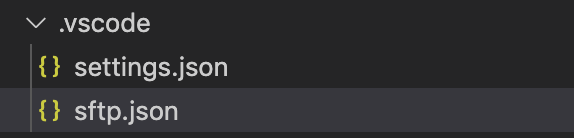
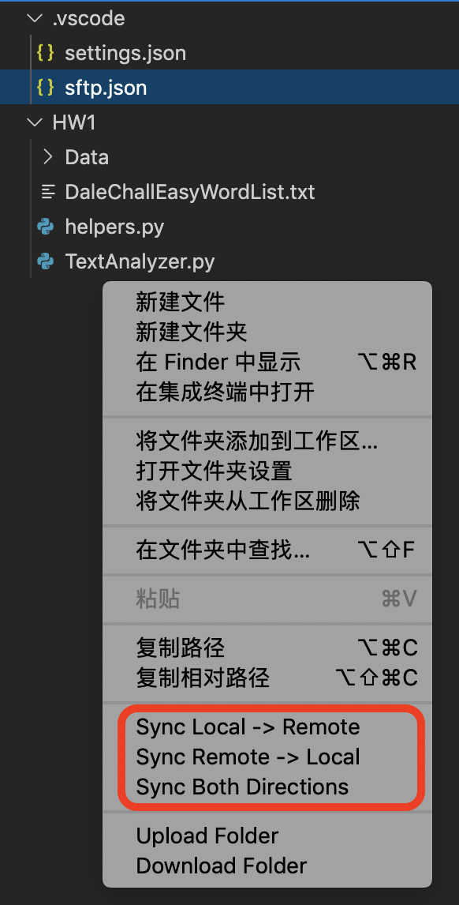

# SFTP configuration for VS Code

## Main reason: It's convenient. When you do "ctrl-s", all my changes can be saved on the remote server.

## How to use

### 1. Install the following plugin.

### 2. Open the sftp.json, paste the [config.json](config.json), and enter your "$USERNAME", "$PASSWORD", and change "remotePath" you want.

### 3. Upload and Download: right click on the file explorer, there are options you can choose in the red frame below.

